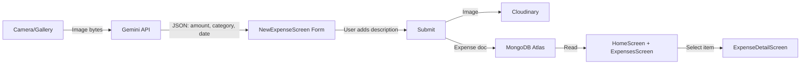

# Gemini Bill Scanner + MongoDB Expense Backend

## Goal

Replace all hardcoded expense data with a real end-to-end pipeline:
1. **User scans/uploads a bill image** → Gemini API extracts amount, category, date
2. **Form auto-fills** extracted data; user adds description
3. **Submit** uploads to Cloudinary + saves expense document to MongoDB
4. **Home & Expenses screens** display real data from MongoDB (dynamic totals, real activity lists)
5. **ExpenseDetail screen** shows the real data for the selected expense

## Architecture



## Proposed Changes

---

### Data Layer

#### [NEW] `data/Expense.kt`
Data class for the expense document:
```kotlin
data class Expense(
    val id: String,            // MongoDB _id
    val employeeName: String,
    val employeeEmail: String,
    val title: String,         // e.g. "Uber", "AWS"
    val amount: Double,
    val currency: String,      // "USD"
    val category: String,      // "TRAVEL", "MEALS", etc.
    val date: String,          // "2024-10-24"
    val description: String,
    val imageUrl: String,      // Cloudinary URL
    val status: String,        // "PENDING" (default on create)
    val createdAt: Long        // System.currentTimeMillis()
)
```

#### [NEW] `data/MongoRepository.kt`
Singleton to talk to MongoDB Atlas via the **Data API** (REST):
- `insertExpense(expense)` — POST to `/action/insertOne`
- `getExpenses(employeeEmail)` — POST to `/action/find` filtered by email
- `getExpenseById(id)` — POST to `/action/findOne`

> [!IMPORTANT]
> **MongoDB Atlas Data API**: Instead of embedding a full MongoDB driver (which requires native libraries and is complex on Android), we'll use the **MongoDB Atlas Data API** — a simple REST endpoint. You need to enable it in your Atlas dashboard: **App Services → Data API → Enable**. This lets us call HTTPS endpoints with your API key.

#### [NEW] `data/GeminiApi.kt`
Calls the **Gemini API** with the bill image:
- Converts image bytes to Base64
- Sends to `https://generativelanguage.googleapis.com/v1beta/models/gemini-2.0-flash:generateContent`
- Prompts Gemini to return JSON: `{ "amount": 42.50, "category": "TRAVEL", "date": "2024-10-24", "title": "Uber" }`
- Parses the response and returns an `ExtractedBillData` object

> [!WARNING]
> **Gemini API Key**: You'll need a Gemini API key. I'll add a placeholder — you must replace it with your own key from [Google AI Studio](https://aistudio.google.com/apikey).

---

### Screen Updates

#### [MODIFY] `NewExpenseScreen.kt`
Major rewrite:
- After image capture/pick → send bytes to `GeminiApi.extractBillData()`
- Show loading spinner while Gemini processes
- Auto-fill: amount, category (as dropdown selection), date, title
- Description remains user-editable
- On submit: upload image to Cloudinary → get URL → save expense to MongoDB via `MongoRepository.insertExpense()`
- Navigate to Expenses on success

#### [MODIFY] `HomeScreen.kt`
- On launch, call `MongoRepository.getExpenses(email)` to load real data
- **Summary cards**: Calculate from real data:
  - Total Expenses = sum of all amounts
  - Pending Approvals = count where status == "PENDING"
  - Approved Amount = sum where status == "APPROVED"
- **Recent Activity**: Show last 4 expenses from MongoDB (with correct category icons)
- **Greeting**: Use `AuthManager.getCurrentUserName()` instead of hardcoded "Ashutosh"

#### [MODIFY] `ExpensesScreen.kt`
- Load all expenses from MongoDB on launch
- Group by date and render dynamically
- Each `HistoryItemCard` uses real data
- Pass expense ID when clicking an item

#### [MODIFY] `ExpenseDetailScreen.kt`
- Receive expense ID from navigation
- Load expense by ID from MongoDB
- Display real: title, amount, date, category, status, image (from Cloudinary URL)

#### [MODIFY] `MainActivity.kt`
- Pass selected expense ID between screens
- Add state: `selectedExpenseId`

---

### Supporting Changes

#### [MODIFY] `compo/Lists.kt`
- Add a utility function `categoryToIcon(category: String): ImageVector` that maps categories like "TRAVEL", "MEALS", "INFRASTRUCTURE" to the correct Material icon

#### [MODIFY] `compo/Inputs.kt`
- Make `AmountInput`, `DropdownInput`, and `DateInput` controllable (accept value + onChange) so Gemini-extracted data can pre-fill them

#### [MODIFY] `build.gradle.kts`
- Add Gemini AI dependency: `implementation("com.google.ai.client.generativeai:generativeai:0.9.0")`
- Add OkHttp for MongoDB Data API calls: `implementation("com.squareup.okhttp3:okhttp:4.12.0")`
- Add Coil for loading Cloudinary image URLs: `implementation("io.coil-kt:coil-compose:2.6.0")`

## User Review Required

> [!WARNING]
> **MongoDB Atlas Data API** must be enabled in your Atlas dashboard. Go to **Atlas → App Services → Create App → Data API → Enable**. Copy the App ID and API Key when it's set up. I'll add placeholders in the code.

> [!IMPORTANT]
> **Gemini API Key**: You need a key from [Google AI Studio](https://aistudio.google.com/apikey). I'll put a placeholder in `GeminiApi.kt`.

> [!NOTE]
> The MongoDB connection string you provided (`mongodb+srv://...`) is for driver-based connections. On Android, we'll use the **Data API (REST)** instead, which is simpler and doesn't require native libraries. The Data API uses your same Atlas cluster but through HTTPS.

## Open Questions

1. **Do you have a Gemini API key?** If not, I'll use a placeholder and you can add it later.
2. **Have you enabled the MongoDB Atlas Data API?** If not, I can guide you through it after implementation.

## Verification Plan

### Manual Verification
1. Take a photo of a receipt → verify Gemini extracts amount/category/date
2. Submit expense → verify it appears in Expenses screen
3. Check Home screen totals update correctly
4. Click an expense → verify detail screen shows correct data
5. Kill app and reopen → verify expenses persist (loaded from MongoDB)
