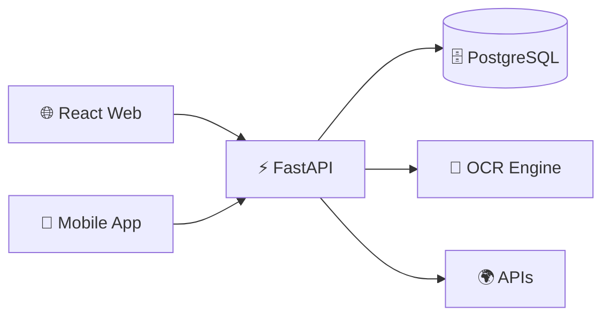

<h1 align="center">🚀 Reimbursement Management System</h1>

<p align="center">
  
</p>

<p align="center">
  
  
  
  
</p>

<p align="center">
  
</p>

---

<h2 align="center">✨ About Project</h2>

<p align="center">
💡 A next-gen reimbursement system that automates expense tracking, approvals, and receipt processing using OCR and intelligent rule engines.  
</p>

---

<h2 align="center">⚡ Features</h2>

<p align="center">
🔥 Multi-Level Approval System <br>
🤖 OCR Automation (Scan → Auto Fill) <br>
🌍 Multi-Currency Support <br>
⚡ Real-Time Updates <br>
📱 Cross Platform (Web + App)
</p>

---

<h2 align="center">🧠 Architecture</h2>



---

<h2 align="center">💻 Code Preview</h2>

<p align="center">⚡ Backend</p>

```python id="t93zom"
from fastapi import FastAPI

app = FastAPI()

@app.get("/")
def home():
    return {"message": "System Running 🚀"}
```

<p align="center">🎨 Frontend</p>

```jsx id="pq7ygr"
export default function App() {
  return <h1>🚀 Expense Dashboard</h1>;
}
```

---

<h2 align="center">📊 Workflow</h2>

<p align="center">
👤 Employee → Submit 💸 <br>
↓ <br>
📸 OCR → Extract Data <br>
↓ <br>
👨‍💼 Manager → Approve / Reject <br>
↓ <br>
👑 Admin → Final Decision <br>
↓ <br>
📊 Status → Updated
</p>

---

<h2 align="center">📦 Setup</h2>

```bash id="8r6r1l"
git clone https://github.com/your-username/repo.git
cd repo

npm install
npm run dev

pip install -r requirements.txt
uvicorn main:app --reload
```

---

<h2 align="center">🎥 Demo</h2>

<p align="center">
🌐 Live: https://your-link.com <br>
🎬 Video: https://your-video.com
</p>

---

<h2 align="center">🏆 Achievements</h2>

<p align="center">

</p>

---

<h2 align="center">🔥 Stats</h2>

<p align="center">


</p>

---

<h2 align="center">🐍 Contribution Snake</h2>

<p align="center">

</p>

---

<h2 align="center">💙 Final Note</h2>

<p align="center">
“Turning manual reimbursement into an intelligent automated system.”  
</p>

<p align="center">
🚀 Built for Hackathon Dominance 🚀
</p>
